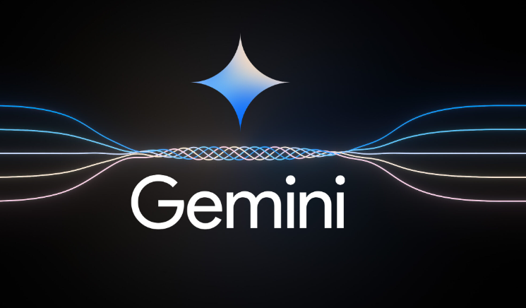

# Flutter Google Gemini Chat App

## Features
- Text Messaging: Users can send and receive text messages.
- Image Submission: Users have the ability to upload images to query information or explanations.
- Combined Text and Image Queries: The app supports queries that combine both text and images.

## Getting Gemini key: https://makersuite.google.com/app/apikey
